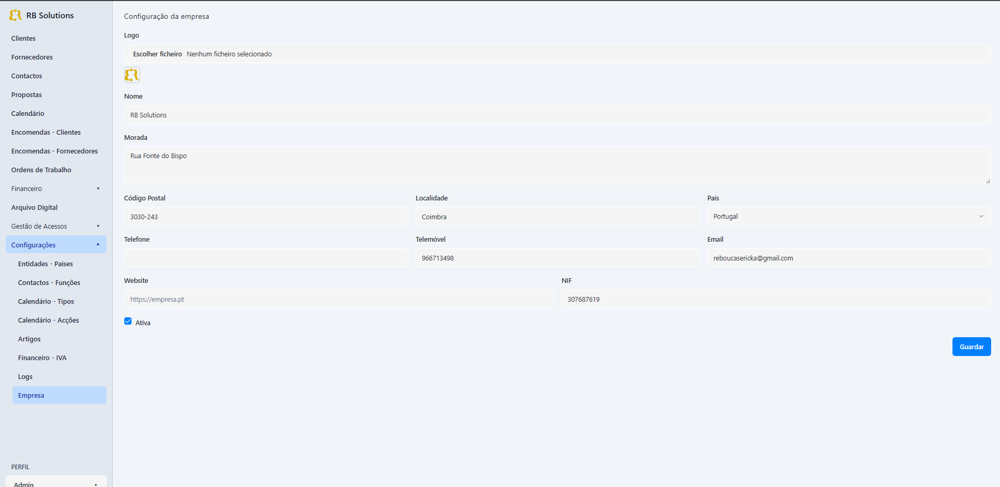
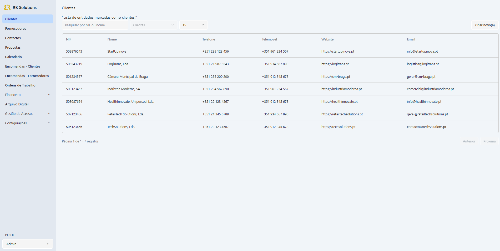
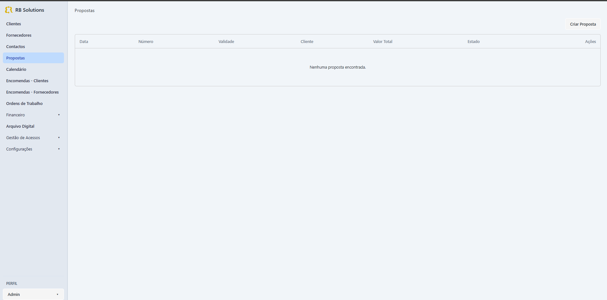
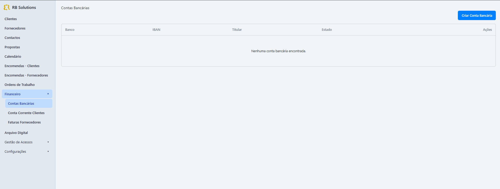
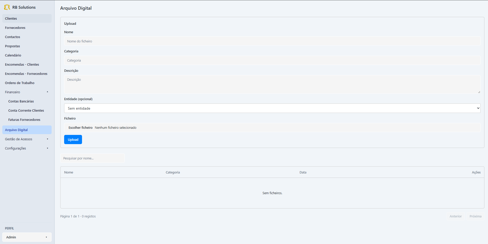
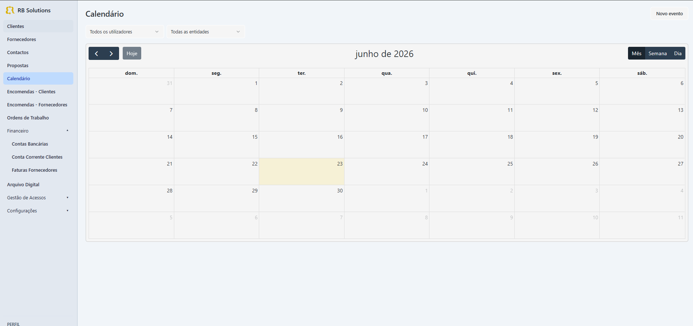
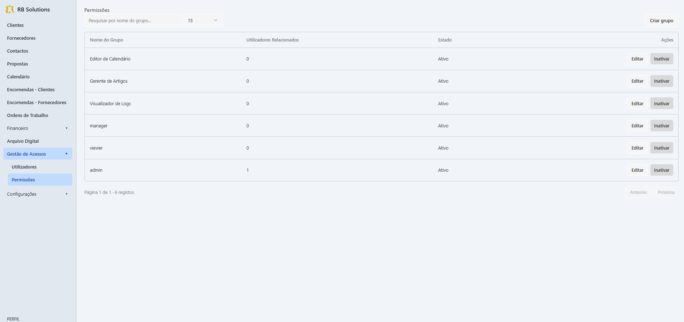

# Sistema de Gestão Empresarial (ERP)


Sistema de Gestão Empresarial (ERP) desenvolvido durante estágio profissional na Inovcorp para apoiar a gestão operacional de empresas através da centralização de processos comerciais, financeiros e documentais.

A aplicação foi criada para centralizar e organizar processos empresariais num único sistema, permitindo gerir clientes, fornecedores, propostas comerciais, encomendas, ordens de trabalho, faturação, documentos e calendário operacional.

## Objetivo do Projeto

Desenvolver uma solução integrada capaz de centralizar a informação empresarial e apoiar a gestão operacional da organização, reduzindo tarefas manuais, aumentando a rastreabilidade dos processos e melhorando o controlo sobre atividades comerciais, técnicas e financeiras.

## Principais Funcionalidades

* Gestão de clientes e fornecedores
* Gestão de contactos e dados comerciais
* Propostas comerciais com geração automática de PDF
* Encomendas de clientes e fornecedores
* Ordens de trabalho
* Gestão financeira e faturação
* Arquivo digital de documentos
* Calendário operacional e acompanhamento de atividades
* Gestão de utilizadores, papéis e permissões
* API REST para integração de dados

---

## Screenshots

### Tela inicial


### Dashboard / Visão geral



### Gestão de Entidades



### Propostas Comerciais



### Financeiro / Faturação



### Arquivo Digital



### Calendário Operacional



### Gestão de Utilizadores e Permissões



---

## Índice

- [Visão Geral](#visão-geral)
- [Arquitetura](#arquitetura)
- [Stack Tecnológica](#stack-tecnológica)
- [Módulos](#módulos)
- [Controlo de Acessos](#controlo-de-acessos)
- [Estrutura do Projeto](#estrutura-do-projeto)
- [Requisitos](#requisitos)
- [Instalação](#instalação)
- [Comandos Úteis](#comandos-úteis)
- [Testes](#testes)
- [Boas Práticas](#boas-práticas)
- [Estado do Projeto](#estado-do-projeto)
- [Autora](#autora)
- [Licença](#licença)

---

## Visão Geral

O sistema centraliza a gestão operacional da empresa num único ambiente web, integrando todo o ciclo de vida comercial — desde o contacto inicial com o cliente, passando pela proposta, encomenda e execução da ordem de trabalho, até à faturação e arquivo documental.

Principais objetivos:

- Unificar processos comerciais, técnicos e financeiros.
- Reduzir trabalho manual com geração automática de PDFs (propostas, encomendas, faturas).
- Garantir rastreabilidade através de logs, histórico e permissões granulares.
- Disponibilizar uma interface rápida, responsiva e consistente.

---

## Arquitetura

### Backend

- **Laravel 12** (PHP 8.2+)
- **Laravel Sanctum** + **Fortify** — autenticação por token/SPA
- **Spatie Laravel Permission** — ACL (roles + permissions)
- **API REST** versionada em `/api/v1`
- Padrão de camadas: **Controllers → Services → Models → Policies**
- **Form Requests** para validação
- **API Resources** para serialização
- Geração de PDFs via templates Blade

### Frontend

- **Vue 3** com **Composition API** e `<script setup>`
- **TypeScript** em modo estrito
- **Vite** como bundler
- **Pinia** para gestão de estado
- **Vue Router** com guards de permissão
- **TailwindCSS** + **shadcn-vue** para UI
- **Zod** + **Vee-Validate** para validação de formulários
- **Axios** com interceptors para autenticação e tratamento de erros
- Arquitetura **modular por domínio** (`src/modules/*`)

---

## Stack Tecnológica

| Camada          | Tecnologias                                                        |
| --------------- | ------------------------------------------------------------------ |
| Backend         | Laravel 12, PHP 8.2+, MySQL/MariaDB                                |
| Autenticação    | Sanctum, Fortify                                                   |
| Autorização     | Spatie Permission, Policies                                        |
| Frontend        | Vue 3, TypeScript, Vite, Pinia, Vue Router                         |
| UI              | TailwindCSS, shadcn-vue, Lucide Icons                              |
| Validação       | Zod, Vee-Validate (frontend) · Form Requests (backend)             |
| Testes          | PHPUnit, Laravel Test Suite                                        |
| DevOps          | Git, Conventional Commits                                          |

---

## Módulos

| Módulo                     | Descrição                                                                 |
| -------------------------- | ------------------------------------------------------------------------- |
| Entidades                  | Gestão de clientes e fornecedores (dados fiscais, moradas, contactos).    |
| Contactos                  | Pessoas associadas a entidades, com funções e meios de contacto.          |
| Propostas                  | Criação, versionamento e exportação de propostas comerciais em PDF.       |
| Encomendas (Clientes)      | Conversão de propostas, gestão de linhas e estados.                       |
| Encomendas (Fornecedores)  | Gestão de compras e integração com faturas de fornecedor.                 |
| Ordens de Trabalho         | Planeamento e execução técnica de serviços.                               |
| Financeiro                 | Faturas emitidas/recebidas, contas correntes, ligação a encomendas.       |
| Arquivo Digital            | Repositório de ficheiros com metadados, permissões e pré-visualização.    |
| Calendário                 | Ações e eventos (reuniões, tarefas, follow-ups) com tipos configuráveis.  |
| Utilizadores e Permissões  | Gestão de utilizadores, papéis (roles) e permissões granulares.           |
| Definições                 | Países, IVA, artigos, funções de contacto, tipos de calendário, logs.     |

---

## Controlo de Acessos

Sistema de permissões granulares end-to-end:

- **Backend:** `Spatie\Permission` + `Policies` por recurso.
- **Frontend:**
  - Guards de rota baseados em permissões.
  - Redirecionamento dinâmico para a primeira rota permitida (`resolveHomeByPermission`).
  - Ocultação de componentes/ações sem permissão.

Convenção das permissões:

```
<módulo>.<ação>
```

Exemplos:

```
entities.view
entities.create
finance.read
users.create
permissions.manage
```

---

## Estrutura do Projeto

```
sistemagestao/
├── apps/
│   ├── backend/                 # Laravel 12 (API)
│   │   ├── app/
│   │   │   ├── Http/Controllers/Api/V1/
│   │   │   ├── Http/Requests/
│   │   │   ├── Http/Resources/
│   │   │   ├── Models/
│   │   │   ├── Policies/
│   │   │   └── Services/
│   │   ├── database/migrations/
│   │   ├── database/seeders/
│   │   ├── resources/views/pdf/ # Templates de PDF
│   │   ├── routes/api.php
│   │   └── tests/
│   │
│   └── frontend/                # Vue 3 + Vite
│       └── src/
│           ├── components/ui/   # shadcn-vue
│           ├── composables/
│           ├── layouts/
│           ├── modules/         # Módulos de domínio
│           │   ├── entities/
│           │   ├── proposals/
│           │   ├── client-orders/
│           │   ├── supplier-orders/
│           │   ├── work-orders/
│           │   ├── finance/
│           │   ├── digital-archive/
│           │   ├── calendar/
│           │   └── access-management/
│           ├── router/
│           └── services/
└── README.md
```

---

## Requisitos

- **PHP** 8.2 ou superior (com extensões: `pdo`, `mbstring`, `openssl`, `tokenizer`, `xml`, `ctype`, `json`, `bcmath`, `fileinfo`, `gd`)
- **Composer** 2.x
- **Node.js** 20+ e **npm** 10+
- **MySQL** 8+ ou **MariaDB** 10.6+

---

## Instalação

### 1. Clonar o repositório

```bash
git clone <url-do-repositorio> sistemagestao
cd sistemagestao
```

### 2. Backend (Laravel)

```bash
cd apps/backend
composer install
cp .env.example .env
php artisan key:generate
php artisan migrate --seed
php artisan storage:link
php artisan serve
```

A API fica disponível em `http://localhost:8000/api/v1`.

### 3. Frontend (Vue 3)

Numa nova janela de terminal:

```bash
cd apps/frontend
npm install
npm run dev
```

A aplicação abre em `http://localhost:5173`.

> Certifica-te que a variável `VITE_API_URL` no `.env` do frontend aponta para o URL do backend.

---

## Comandos Úteis

### Backend

```bash
php artisan migrate:fresh --seed     # Reset + seed da base de dados
php artisan db:seed --class=...      # Executa um seeder específico
php artisan route:list               # Lista todas as rotas
php artisan cache:clear              # Limpa cache aplicacional
php artisan config:clear             # Limpa cache de configuração
```

### Frontend

```bash
npm run dev          # Servidor de desenvolvimento
npm run build        # Build de produção
npm run preview      # Pré-visualização do build
npm run lint         # Linter (ESLint)
npm run type-check   # Verificação de tipos TypeScript
```

---

## Testes

```bash
cd apps/backend
php artisan test
```

Os testes cobrem autenticação, permissões, endpoints da API e regras de negócio principais.

---

## Boas Práticas

- **Service Layer** — lógica de negócio isolada dos controllers.
- **Form Requests** — validação e autorização declarativas.
- **API Resources** — serialização consistente de respostas.
- **Policies + Permissions** — autorização granular por recurso.
- **Arquitetura modular** — separação por domínio no frontend.
- **TypeScript estrito** — segurança de tipos em toda a camada cliente.
- **Conventional Commits** — histórico de commits semântico e legível.

---

## Estado do Projeto

- Sistema completo e funcional
- Integração total entre backend e frontend
- Controlo de acessos implementado end-to-end
- Geração de PDFs operacional (propostas, encomendas, faturas)
- Pronto para uso em ambiente real

---

## Autora

**Ericka Rebouças**
Estágio profissional · Inovcorp

---

## Licença

Uso académico e profissional.
